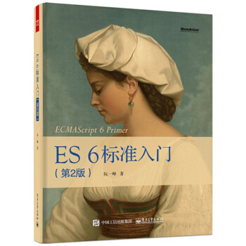

# 《ECMAScript 6 入门（第2版）》

## 第四章：字符串的扩展

> 今天读到阮一峰大侠写到`模板字符串`时，突然茅塞顿开。多读书真好！😢

 - 字符的Unicode表示法
 JavaScript允许采用\uxxxx形式表示一个字符，其中“xxxx”表示字符的码点。但是，这种表示法只限于\u0000——\uFFFF之间的字符。ES6中只要将码点放入大括号，就能正确解读该字符。`'\u{1F680}' === '\uD83D\uDE80'`

 - codePointAt()：返回32位十进制的UTF-16字符的码点。
 - String.fromCodePoint()：码点转字符
 - 字符串的遍历器接口：使用`for...of`遍历，用for循环遍历中文会出错。
 - at()：返回字符给定位置的字符，可以用户Unicode编号大`0xFFFF`的字符。
 - normalize()：将字符Unicode正规化。
 - includes(), startsWith(), endsWith() ：include返回bool值，表示站到了参数字符串；startWith：返回布尔值，表示参数字符串是否在元字符串的头部；endsWith：返回布尔值，表示参数字符串是否在源字符串的尾部。（这个可以用在过滤条件中嘛）
 - repeat()：返回一个字符串，表示将原字符串重复n此。
 - padStart()，padEnd()：ES2017引入了字符补串全长度的功能，一个从头补，一个从尾开始补全。
 - 模板字符串：使用反引号（`）标识N个段落，用`${}`在字符串中加入变量，用反斜杠(\)转义。更可以使用如下字符串模板：
例如将稍微长点的t-sql语句转换成JavaScript传统字符串如下：
```sql
select FID, FNumber, FName_L2, FCreator from T_IM_SaleIssueEntry where FBizDate between '2017-01-01' and '2017-03-01' and FBaseStatus = 4 --这里只是演示，生产环境300行起。
```
```JavaScript
var sqlCommand = 
  'select FID, FNumber, FName_L2, FCreator ' + 
  'from T_IM_SaleIssueEntry ' + 
  'where FBizDate between \'2017-01-01\' and \'2017-03-01\' ' +
         'and FBaseStatus = ' + baseStatus +'
```

那么用ES6就可以这样写：
```JavaScript
var sqlCommand = `
  select FID, FNumber, FName_L2, FCreator 
  from T_IM_SaleIssueEntry 
  where FBizDate between \'2017-01-01\' and \'2017-03-01\' 
  and FBaseStatus = ${baseStatus}`
```

- **模板编译：**

```javascript
var template = `
<ul>
  <% for(var i=0; i < data.supplies.length; i++) { %>
    <li><%= data.supplies[i] %></li>
  <% } %>
</ul>
`;

// 模板编译函数：
function compile(template){
  var evalExpr = /<%=(.+?)%>/g;
  var expr = /<%([\s\S]+?)%>/g;

  template = template
    .replace(evalExpr, '`); \n  echo( $1 ); \n  echo(`')
    .replace(expr, '`); \n $1 \n  echo(`');

  template = 'echo(`' + template + '`);';

  var script =
  `(function parse(data){
    var output = "";

    function echo(html){
      output += html;
    }

    ${ template }

    return output;
  })`;

  return script;
}
```

compile函数的用法如下：
```javascript
var parse = eval(compile(template));
div.innerHTML = parse({ supplies: [ "broom", "mop", "cleaner" ] });
//   <ul>
//     <li>broom</li>
//     <li>mop</li>
//     <li>cleaner</li>
//   </ul>
```

- 标签模板：它可以紧跟在一个函数名后面，该函数将被调用来处理这个模板字符串。这被称为“标签模板”功能（tagged template）。也就是说用\`\`将参数传入函数。
- String.raw()：往往用来充当模板字符串的处理函数，返回一个斜杠都被转义（即斜杠前面再加一个斜杠）的字符串，对应于替换变量后的模板字符串。