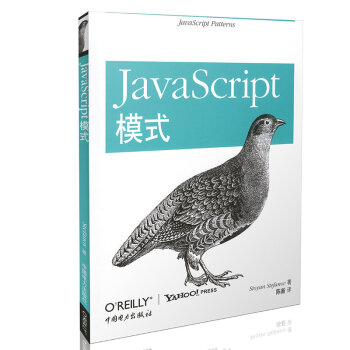

# 《JavaScript模式》

> 模式是针对普遍问题的解决方案。更进一步说，模式是解决一类特定问题的模板。

> 模式会有助于将问题分解为一个个像积木一样的小模块，并集中精力处理从各种烦琐的细节中提炼出来的该问题所特有的部分。

> 模式通过提供一个通用的词典来帮助我们更好地进行交流，因此学习并识别模式是很重要的。

## 第一章：简介

JavaScript是一门与众不同的语言。它没有类，并且函数时用于很多任务的顶层类对象。

#### 模式

- 广义上模式是指，“重现事件或者对象的主题……它是一个可以用来产生其他事物的末班或者模型”。
- 在软件开发过程中，模式是指一个通用问题的解决方法。一个模式不仅仅是一个可以用来复制粘贴的代码解决方案，更多地是提供了一个更好的实践经验、有用的抽象化表示和解决一类问题的模板。

- 学习和识别模式是非常重要的，理由如下(为什么要学习模式)：
  - 通过学习模式，可以帮助我们使用经过实践证明有效的经验来编写代码，而无需做很多无用的工作。(大概是节约时间吧🤔)
  - 模式提供了某种程度上的抽象。大脑在一定的时间内仅能记住一定数量的内容，因此当思考更复杂的问题时，使用模式可以让您集中精力去用已有的模式来解决该问题，而不需被一些低层次的细节所困扰。(真实说到了我的心底啊😂)
  - 模式可以改善开发者和开发团队之间的交流，通常开发者是采取远程交流而不是面对面交流。为一些编码技术或者方法贴上标签并命名，可以很方便地确保双发能够了解对方切实想表达的意思。栗子一个，如果需要表达“用大括号括上一个函数，并在刚刚定义这个函数的结束位置放置一个括号来调用该函数”这层意思时，直接使用“立即函数IIFE”这样的称法更为简单明了。

- 相对于JavaScript的设计模式来说，过去设计模式主要是从强类型的视角进行研究的，列入C++或Java等。有时将这些模式严格地应用于JavaScript这样弱类型动态语言是没有必要的，这些模式是适用于处理请类型语言的一些本性和基于类的继承。

### JavaScript基本概念

> 最近我对js基本概念就是碎碎念了~

#### 面向对象

 - JS中只有五种基本类型不是对象：数值类型、字符串类型、布尔类型、Null类型和Undefined类型。其中前三个类型有对应的以基本类型封装形式体现的对象表示，且三者类型的值可以实现向对象的转换。
 
- 在JavaScript中，一旦定义好了变量，同时也就已经在处理对象了。
   1. 首先该变量会自动成为内置对象的一个属性，成为激活对象(如果是全局变量，则成为全局对象的一个属性)；
   2. 该变量实际上也是伪类，因为它拥有其自身的属性(attributes)，该属性决定了该变量是否可以被修改、被删除和一个在for-in循环中进行枚举(就那四个属性了，我不说了)。

- 对象主要有两种类型：
  1. 原生的(Native)：在ECMAScript标准中有详细描述。
  2. 主机的(Host)：在主机环境中定义的(如浏览器环境)

- 原生对象可以进一步分为内置对象(例如数组、日期对象等)和用户自定义对象(例如`var myObj = {}`)等
- 主机对象包含window对象和所有DOM对象(BOM还没说完的啊😒)。

> 原书中创建类啊、constructor啊、prototype啊都比较浅，就不说了。
